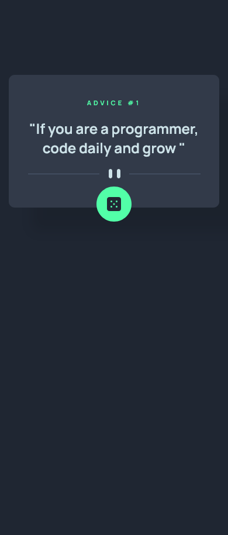
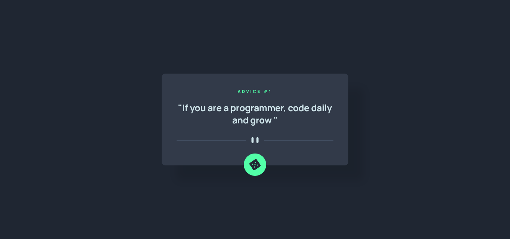

# Frontend Mentor - Advice generator app solution

This is a solution to the [Advice generator app challenge on Frontend Mentor](https://www.frontendmentor.io/challenges/advice-generator-app-QdUG-13db). Frontend Mentor challenges help you improve your coding skills by building realistic projects.

## Table of contents

- [Overview](#overview)
  - [The challenge](#the-challenge)
  - [Screenshot](#screenshot)
  - [Links](#links)
- [My process](#my-process)
  - [Built with](#built-with)
  - [What I learned](#what-i-learned)
  - [Continued development](#continued-development)
- [Author](#author)

## Overview

### The challenge

Users should be able to:

- View the optimal layout for the app depending on their device's screen size
- See hover states for all interactive elements on the page
- Generate a new piece of advice by clicking the dice icon

### Screenshot

### Mobile Screenshot

### Desktop Screenshot

### Links

- Live Site URL: [Advice generator app](https://advice-generator-appproject.netlify.app)

## My process

### Built with

- [React](https://reactjs.org/) - JS library
- Semantic HTML5 markup
- SASS
- Flexbox
- Mobile-first workflow
- [Advice API](https://api.adviceslip.com/advice)

### What I learned

I learnt how to implement async and await in my code to fetch data from an API

### Continued development

I will like to work more with apis in the future and also with React.JS, to write more declarative codes

## Author

- Website - [CodeStan Portfolio](https://codestan.netlify.app/)
- Frontend Mentor - [@code-stan](https://www.frontendmentor.io/profile/code-stan)
- Twitter - [@Codestanley](https://www.twitter.com/codestanley)
